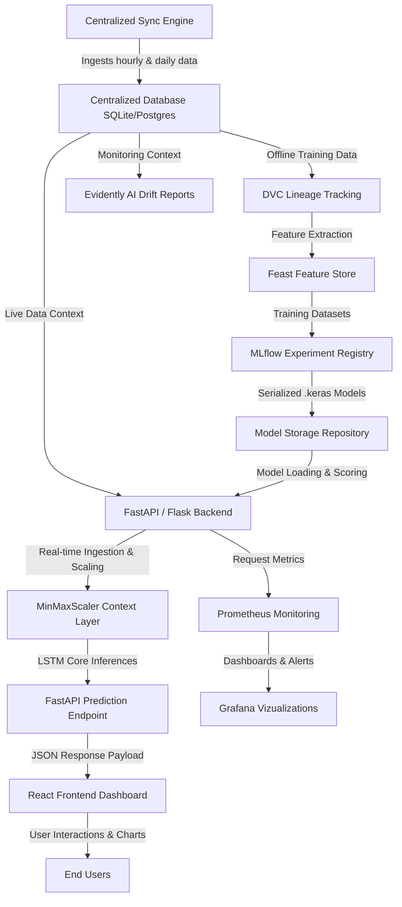

# 🔮 CryptoPredictPro: End-to-End MLOps Cryptocurrency Forecasting Platform

Welcome to **CryptoPredictPro**, a production-ready, enterprise-grade full-stack MLOps platform that orchestrates real-time data ingestion, automated feature engineering, deep learning-based price forecasting, model lineage tracking, drift monitoring, and automated CI/CD deployments for 13 major cryptocurrencies.

This manual details the entire system architecture, technical stack, operational mechanics, and core features of the platform.

---

## 🏗️ 1. System Architecture Overview

CryptoPredictPro is designed using a **modular, microservices-oriented architecture** that bridges the gap between state-of-the-art Deep Learning (LSTM models) and robust MLOps practices. 

The platform's data and execution flow operates as follows:



---

## 🛠️ 2. Comprehensive Technology Stack

The platform integrates a curated stack of modern web development and professional-grade MLOps tools:

### 🖥️ Frontend (React & Modern UI)
* **Framework:** React.js bootstrapped with **Vite** for ultra-fast hot reloading and production builds.
* **Styling:** **Vanilla CSS / Custom TailwindCSS** following glassmorphism principles (soft-glowing borders, deep dark panels, and futuristic neon accents).
* **Data Visualization:** **Recharts** (highly responsive SVG charts for rendering actual vs. AI-predicted timelines).
* **Icons:** **Lucide React** (high-quality modern vector iconography).
* **HTTP Client:** **Axios** (handling asynchronous calls to backend APIs with timeout boundaries).

### ⚙️ Backend (Python API Services)
* **Web Server Gateway:** **FastAPI** (handling high-performance async endpoints, health checks, and Prometheus metrics) acting as a wrapper alongside a legacy **Flask** application via **WSGIMiddleware** (Strangler Fig pattern for progressive migration).
* **Server Runner:** **Uvicorn** (asynchronous ASGI server).
* **Database Connectors:** **sqlite3** (for local development) and **psycopg2-binary** (for PostgreSQL production scaling), integrated via a dual-syntax SQL adapter layer.

### 🧠 Deep Learning & Math Engine
* **Deep Learning Framework:** **TensorFlow 2.x / Keras** (utilizing Long Short-Term Memory - LSTM networks optimized for sequential patterns).
* **Preprocessing:** **scikit-learn** (`MinMaxScaler` for normalizing live sequence inputs between 0 and 1).
* **Data Manipulation:** **Pandas** and **NumPy** (for vectorized rolling windows, volatility metrics, and DataFrame preprocessing).

### 🤖 The MLOps Pipeline Core
* **Data Versioning & Lineage:** **DVC (Data Version Control)**. Tracks datasets, registers hash identifiers, and handles offline storage in remote storage.
* **Feature Management:** **Feast (Feature Store)**. Centralizes feature definitions (`feature_repo/`), maintains a local/production registry (`registry.db`), and handles low-latency online stores (`online_store.db`) to eliminate offline-online feature skew.
* **Experiment Tracking & Logging:** **MLflow**. Logs hyperparameter configurations, metrics (Loss, MSE, MAE), model training artifacts, and tracks active runs in a local SQLite database (`mlflow.db`).
* **Data Validation:** **Great Expectations**. Asserts schema rules, range checks, and non-null values before pipeline stages.
* **Model Quality Testing:** **Promptfoo**. Automatically tests model behavior and API boundary conditions against predefined assertion test cases (`promptfooconfig.yaml`).
* **Drift & Performance Monitoring:** **Evidently AI** (generates diagnostic dashboards for Data Drift and Target Drift) + **Prometheus** (tracks custom server metrics like requests and average latencies) + **Grafana** (visualizes system performance and server vitals).
* **Containerization & Deployment:** **Docker**, **Docker Compose** (for orchestrating React, FastAPI, MLflow, and Prometheus locally), **Kubernetes (K8s)** (for declarative scaling), and **ArgoCD** (GitOps automated deployment pipeline).

---

## 🎯 3. Core Feature Implementation & Mechanics

### 🔮 A. AI Price Prediction (LSTM & Fallback Forecasts)
The prediction system predicts the future price of a selected cryptocurrency over a chosen timeframe (Hourly or Daily).

#### The LSTM Pipeline:
1. **Context Fetch:** The API queries the database `ohlcv` table for the last 100 historical intervals of the requested coin and timeframe.
2. **Real-time USD-INR Alignment:** The backend hits CoinDesk's history API to fetch the absolute latest USD price. It converts this to INR using the live exchange rate fetched from the Frankfurter API and injects it as the final index item.
3. **Sequence Structuring:** The code extracts the `close` prices into a sequence of length 100.
4. **MinMax Scaling:** A `MinMaxScaler(feature_range=(0,1))` fits *specifically* on the 100 historical prices of that context. This solves the **scale anomaly** (because the scaler adapts dynamically to whatever range the price is in—whether ₹10 for Dogecoin or ₹74,00,000 for Bitcoin).
5. **Prediction Input:** The last 60 normalized timesteps are extracted, reshaped to `(1, 60, 1)`, and fed into the coin's specific pre-trained `.keras` LSTM model.
6. **Inverse Transform:** The model outputs a normalized value, which is inverse-transformed back to the original price scale to produce `predictedPrice`.

```python
# Practical implementation snippet in app.py
scaler = MinMaxScaler(feature_range=(0, 1))
scaled_data = scaler.fit_transform(close_prices) # Normalizes INR context
X_input = np.array([scaled_data[-SEQ_LEN:]]).reshape((1, SEQ_LEN, 1)) # Last 60 points
predicted_scaled = model.predict(X_input, verbose=0)
predicted_price = float(scaler.inverse_transform(predicted_scaled)[0][0]) # Correct INR
```

#### The Volatility Confidence Score:
Rather than returning a static number, the system calculates a dynamic confidence score based on recent volatility:
$$\text{Volatility} \% = \left(\frac{\sigma}{\mu}\right) \times 100$$
$$\text{Confidence} = \max(50, \min(95, 95 - 3 \times \text{Volatility} \%))$$
Lower volatility indicates a more stable consolidation range, resulting in a higher confidence score (capped between 50% and 95%).

#### Statistical Fallback Engine:
If the model file is missing or tensor execution fails, the system automatically falls back to a momentum-based statistical forecast:
$$\text{Drift} = \text{Average Change over last 10 points} + \mathcal{N}(0, 0.1 \times \sigma)$$
This provides a safe and premium statistical projection in real time.

---

### ⏱️ B. Real-time Ingestion & Centralized Sync Engine
To maintain a fresh production environment, a background worker runs every 15 minutes to synchronize prices.

```python
# Centralized Sync Engine in data_sync.py
def sync_coin_data(coin_name, instrument, interval_type):
    # 1. Queries SELECT MAX(timestamp) from ohlcv to get the last synced time
    # 2. Hits CoinDesk API index/cc/v1/historical/{interval_type}
    # 3. Pulls new records since the last synced timestamp in chunks
    # 4. Detects database type (SQLite vs. PostgreSQL)
    # 5. Executes a bulk, transactional upsert batch
```

To bridge SQLite (local) and PostgreSQL (production), the SQL operations are parsed using environment indicators:
```python
is_postgres = DATABASE_URL and ("postgres" in DATABASE_URL or "postgresql" in DATABASE_URL)
if is_postgres:
    from psycopg2.extras import execute_values
    query = """
        INSERT INTO ohlcv (coin, timeframe, timestamp, open, high, low, close, date)
        VALUES %s
        ON CONFLICT (coin, timeframe, timestamp) DO UPDATE SET
        open = EXCLUDED.open, high = EXCLUDED.high, low = EXCLUDED.low, close = EXCLUDED.close
    """
    execute_values(cursor, query, all_new_records)
else:
    query = "INSERT OR REPLACE INTO ohlcv ... VALUES (?, ?, ?, ?, ?, ?, ?, ?)"
    cursor.executemany(query, all_new_records)
```

---

### 📊 C. Interactive User Dashboards
The frontend dashboard coordinates these layers into a premium visual experience:
* **Coin Ticker Tape:** Glides along the top of the interface, showcasing live real-time prices for all 13 supported assets.
* **Interactive Charting:** Displays actual vs. predicted prices side-by-side using responsive **Recharts** lines.
* **Real-time Live Indicator:** Emits a pulsing neon green indicator representing real-time Binance/CoinDesk data synchronization status.
* **Trade Booking Simulator:** Simulates virtual trade booking with virtual wallet limits, tracking transactional trade entries.

---

## 🔄 4. How the MLOps Components Work Under the Hood

Each MLOps tool serves a precise, functional purpose within the pipeline, removing any manual guesswork from the lifecycle:

```
  [ Raw Data Ingest ]
          │
          ▼
   [ DVC Datasets ]  ── (Tracks versions via hashes in Git)
          │
          ▼
  [ Great Expect. ]  ── (Asserts data quality & schema checks)
          │
          ▼
   [ Feast Store ]   ── (Registers & materializes offline/online features)
          │
          ▼
   [ MLflow Runs ]   ── (Registers models & tracks loss/metrics)
          │
          ▼
   [ Promptfoo Test ] ── (Validates API boundary inputs & assertions)
          │
          ▼
  [ Evidently Drift] ── (Monitors target & data drift in production)
```

1. **DVC (Data Version Control):** Files ending in `.dvc` (e.g. `data.csv.dvc`) store unique md5 hash checksums. DVC ensures that raw database tables or CSV outputs can be pulled/pushed to a remote store without committing massive datasets directly into your Git history.
2. **Great Expectations:** Runs validation suites (`validation_playlist.json`) asserting that our dataset has exactly 8 columns, that close prices are positive reals, and timestamps are not null. If expectations fail, the pipeline halts.
3. **Feast (Feature Store):** Features are declared in `feature_repo/` (e.g., historical close values, rolling averages). Feast compiles these features into `registry.db`. Running `feast materialize` reads historical database inputs and pushes them to low-latency key-value stores (`online_store.db`) so the API can fetch features instantly.
4. **MLflow Tracking:** During training (`train_models.py`), a local MLflow client logs learning parameters (epochs, batch size) and metrics (MSE, MAE, validation loss) into `mlruns/` and stores references inside `mlflow.db`. The best model is serialized and saved in Keras format.
5. **Promptfoo Assertions:** Executes test cases verifying that the `/predict` API performs correctly. If an invalid coin is requested, it asserts that the API correctly returns a `404` status with an error message instead of throwing an unhandled `500 Server Error`.
6. **Evidently AI Monitoring:** Compares our baseline training data with live database inputs. If the price distribution changes significantly, the drift report highlights statistical discrepancies, alerting developers that it's time to trigger a model retraining loop.

---

## 🏃‍♂️ 5. Step-by-Step Production Execution Trace

When an end-user clicks **"Avalanche (AVAX)"** on the frontend:

1. **React State Change:** The state updates `selectedCrypto` to `AVAX`, triggering an async Axios `POST` request to `/predict` with payload `{"coin": "AVAX", "timeframe": "hourly"}`.
2. **FastAPI Route Interception:** FastAPI captures the request, forwards it to Flask via the WSGI layer, and begins timing the latency.
3. **Database Pull:** The database connection is established. It pulls the last 100 hourly entries of AVAX close prices from the PostgreSQL database on Render.
4. **Live Injection:** The backend makes a background request to Frankfurter to get the current USD to INR exchange rate. It multiplies this by the live CoinDesk AVAX-USD price and appends this live INR value as the final record in the context array.
5. **Inference Execution:**
   * It fits `MinMaxScaler` on the context array.
   * It scales the last 60 entries.
   * It loads the pre-compiled `AVALANCHE_INR.keras` file.
   * It runs the LSTM prediction.
   * It inverse-transforms the predicted scalar back into the correct INR format (e.g., ₹873.37).
6. **JSON Delivery:** The backend packs these items along with the dynamic confidence rating into a JSON response.
7. **UI Render:** The Axios promise resolves. Recharts maps the 100 historical context points + the future forecast point onto a smooth SVG grid, displaying actual vs. predicted curves with neon colors!
