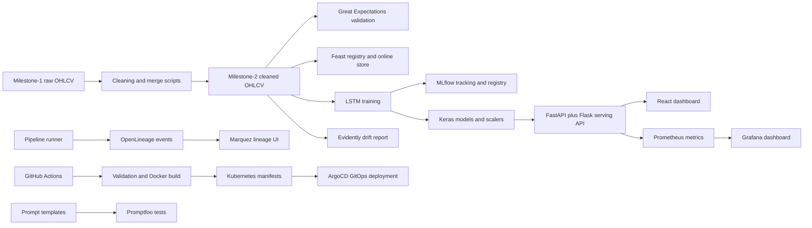
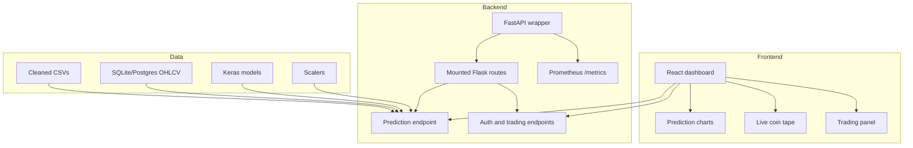

# End-to-End MLOps Architecture

This project is organized as a full MLOps system. The retained system of record includes all 13 supported coins, while the recommended live demo profile uses BTC, ETH, and SOL to keep walkthroughs fast.

## High-Level Flow



## Data Layers

The data layers are intentionally separate:

- **Raw layer:** `milestone-1/daily`, `milestone-1/hourly`
- **Clean training layer:** `milestone-2/infosys/cleaned data/daily`, `milestone-2/infosys/cleaned data/hourly`
- **Live/monitoring layer:** `live_data/daily`, `live_data/hourly`
- **Serving DB layer:** `backened/crypto_pro.db`, table `ohlcv`
- **Model artifact layer:** `milestone-2/infosys/outputs`

All coins are retained. BTC/ETH/SOL is only a fast demo profile.

## Assignment Tool Coverage

| Area | Tool | Implementation |
| --- | --- | --- |
| Data lineage | OpenLineage + Marquez | `backened/pipeline_runner.py` emits sync, cleaning, and training events with input/output dataset paths. Marquez services run in `docker-compose.yml`. |
| Versioning | DVC | `dvc.yaml`, `params.yaml`, `.dvcignore`, and `.dvc/config` define reproducible inventory, validation, Feast, drift, and training stages with local E-drive-friendly DVC storage under `.dvc/`. |
| Data quality | Great Expectations | `scripts/data_quality.py` checks cleaned OHLCV files for required columns, non-null values, positive prices, and timestamp uniqueness. |
| Feature management | Feast | `feature_repo/feature_store.yaml`, `feature_repo/feature_store_def.py`, `scripts/prepare_feast_source.py`, and `scripts/materialize_features.py` prepare, apply, and materialize the crypto feature store. |
| Experiment tracking | MLflow | `backened/train_models.py` logs params, RMSE/MAE/MAPE metrics, Keras models, and registered model names. |
| Serving | FastAPI | `backened/main.py` wraps the existing Flask app and exposes metrics. |
| Frontend | ReactJS | `frontened/cryptopredictpro` contains the prediction and trading dashboard. |
| Model/data monitoring | Evidently AI | `scripts/drift_monitor.py` creates an HTML drift report. |
| Infra monitoring | Prometheus + Grafana | `prometheus/prometheus.yml`, Grafana datasource provisioning, and a provisioned overview dashboard. |
| CI | GitHub Actions | `.github/workflows/mlops-ci.yml` runs DVC restore, data quality, syntax checks, Feast checks, Evidently smoke test, Promptfoo tests, and Docker builds. |
| CD | ArgoCD | `argocd/application.yaml` deploys Kubernetes manifests from `k8s/`. |
| Orchestration/deployment | Docker + Kubernetes | `docker-compose.yml`, backend/frontend Dockerfiles, backend/frontend Kubernetes deployments, and namespace manifest. |
| Prompt management | Promptfoo | `promptfooconfig.yaml`, `prompts/crypto_summary.txt`. |

## Demo Profile

For a fast evaluator demo, run the whole stack against:

`BTC,ETH,SOL`

The training script supports this with:

```powershell
python backened/train_models.py --freq hourly --epochs 1 --coins BTC,ETH,SOL
```

The full retained training set remains available with:

```powershell
python backened/train_models.py --freq both --epochs 3 --coins all
```

## Runtime Architecture


